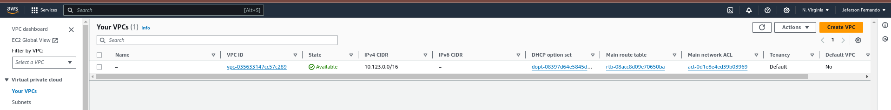

WIP

# Descomplicando Crossplane

## O que iremos ver no dia de hoje

Hoje é dia de conhecer o Crossplane, uma plataforma de gerenciamento de recursos de nuvem que permite a criação de recursos de nuvem como código.
Imagina ter uma ferramenta para gerenciar os seus recursos de nuvem de forma declarativa, como se fosse um Kubernetes para recursos de nuvem, exatamente, criando tudo como código, de forma declarativa e versionando tudo no seu repositório de código. Isso é o Crossplane.

## O que é o Crossplane

A idéia do Crossplane é ter uma forma de criar recursos em diferentes provedores de nuvem, como AWS, Azure e GCP, sempre utilizando o Kubernetes e utilizando manifestos para criar e gerenciar esses recursos.

Vou dar uma exemplo, vamos imaginar que você precise criar um simples bucket no AWS S3, você pode fazer isso utilizando a interface do AWS, ou você pode fazer isso utilizando o Crossplane, de uma maneira simples e organizada, pois amanhã quando você quiser remover esse bucket, você pode fazer isso sem precisar acessar a interface do AWS, ao invés disso iremos usar o Kubectl, da mesma maneira que fazemos para gerenciar os nossos recursos de Kubernetes.

Ele foi desenvolvido pela Upbound, e é um projeto open source, e é uma ferramenta que está em constante evolução, e que tem uma comunidade muito ativa. Isso é muito importante, ter uma comunidade ativa! Pois isso ajuda na garantia de continuidade do projeto.

## Como o Crossplane funciona

O Crossplane é um projeto que utiliza o Kubernetes para gerenciar recursos de nuvem, e para isso ele utiliza o conceito de CRDs (Custom Resource Definitions), que são recursos customizados que podemos criar no Kubernetes e extender a API do Kubernetes.

Com isso, podemos criar recursos de nuvem utilizando o Kubernetes, e para isso, o Crossplane utiliza o conceito de Providers, que são provedores de nuvem, como AWS, Azure e GCP. 

E com esses Providers criamos tudo o que precisamos, como Buckets, Databases, Load Balancers, e muito mais.

## Como instalar o Crossplane

Para fazer a instalação do Crossplane, você pode utilizar o Helm, que é um gerenciador de pacotes para Kubernetes, então nem preciso dizer que você precisa ter o Helm instalado, certo?

Vamos adicionar o repositório do Crossplane no Helm, para isso, execute o comando abaixo:

```bash
helm repo add \          
crossplane-stable https://charts.crossplane.io/stable
helm repo update
```

Agora já podemos seguir com a instalação, mas antes que queria lembrar que vamos ter a instalação simples aqui, para facilitar a nossa vida por enquanto. Mas caso queira conhecer todas as opções de instalação, você pode acessar a documentação oficial do Crossplane.

Agora vamos instalar o Crossplane:

```bash
helm install crossplane \
crossplane-stable/crossplane \
--namespace crossplane-system \
--create-namespace
```

Onde:

- `crossplane` é o nome da release
- `crossplane-stable/crossplane` é o nome do chart que estamos instalando
- `--namespace crossplane-system` é o namespace onde o Crossplane será instalado
- `--create-namespace` é para criar o namespace caso ele não exista

Com isso já teremos o Crossplane instalado no nosso cluster, vamos ver se ele está rodando:

```bash
kubectl get pods -n crossplane-system
```

A saída será algo parecido com isso:

```bash
NAME                                                        READY   STATUS    RESTARTS   AGE
crossplane-5b87fcbc66-qh74s                                 1/1     Running   0          17s
crossplane-rbac-manager-b884bb468-pfkbq                     1/1     Running   0          17s
```

Pronto, temos dois Pods rodando, o Crossplane e o Crossplane RBAC Manager.

Agora precisamos instalar o nosso primeiro Provider, e para começar a festa, vamos de AWS.

Vamos criar um manifesto onde iremos colocar os detalhes sobre o nosso Provider:
    
```yaml
apiVersion: pkg.crossplane.io/v1     
kind: Provider      
metadata:
  name: provider-aws-s3           
spec:
  package: xpkg.upbound.io/upbound/provider-aws-s3:v0.47.0
```

Agora bora aplicar:

```bash
kubectl apply -f provider-aws-s3.yaml
```

Vamos ver se o nosso Provider foi criado:

```bash
kubectl get providers.pkg.crossplane.io
```

A saída será algo parecido com isso:

```bash
NAME                          INSTALLED   HEALTHY   PACKAGE                                              AGE
provider-aws-s3               True        True      xpkg.upbound.io/upbound/provider-aws-s3:v0.47.0      47s
```

Está lá! O nosso Provider da AWS foi criado com sucesso.

Caso queira ver mais detalhes sobre o nosso Provider, você pode executar o comando abaixo:

```bash
kubectl describe providers.pkg.crossplane.io provider-aws-s3
```

A saída:

```bash
Name:         provider-aws-s3
Namespace:    
Labels:       <none>
Annotations:  <none>
API Version:  pkg.crossplane.io/v1
Kind:         Provider
Metadata:
  Creation Timestamp:  2024-02-19T10:30:43Z
  Generation:          1
  Resource Version:    1655
  UID:                 3da0c418-9b6e-4ffc-9f68-f56e1776e633
Spec:
  Ignore Crossplane Constraints:  false
  Package:                        xpkg.upbound.io/upbound/provider-aws-s3:v0.47.0
  Package Pull Policy:            IfNotPresent
  Revision Activation Policy:     Automatic
  Revision History Limit:         1
  Runtime Config Ref:
    API Version:               pkg.crossplane.io/v1beta1
    Kind:                      DeploymentRuntimeConfig
    Name:                      default
  Skip Dependency Resolution:  false
Status:
  Conditions:
    Last Transition Time:  2024-02-19T10:31:25Z
    Reason:                HealthyPackageRevision
    Status:                True
    Type:                  Healthy
    Last Transition Time:  2024-02-19T10:30:43Z
    Reason:                ActivePackageRevision
    Status:                True
    Type:                  Installed
  Current Identifier:      xpkg.upbound.io/upbound/provider-aws-s3:v0.47.0
  Current Revision:        provider-aws-s3-1e7325b432db
Events:                    <none>
```

Para que o nosso Provider funcione, precisamos criar um `Secret` com as credenciais da AWS. Vamos criar um arquivo temporário para armazenar as credenciais, somente para usarmos para a criação do Secret:

```bash
cat <<EOF > aws-creds
[default]
aws_access_key_id = SUA_ACCESS_KEY
aws_secret_access_key = SUA_SECRET_KEY
EOF
```

Lembre-se de adicionar as suas credenciais no lugar de `SUA_ACCESS_KEY` e `SUA_SECRET_KEY`. Essas credenciais são as credenciais que você utiliza para criar recursos na AWS. Cuide bem delas, pois elas são muito importantes.

Agora vamos criar o Secret:

```bash
kubectl create secret generic aws-creds -n crossplane-system --from-file=creds=./aws-creds
```

Vamos listar as Secrets:

```bash
kubectl get secrets -n crossplane-system
```

Temos a nossa Secret criada e com as credenciais da AWS, agora podemos criar recursos na AWS utilizando o Crossplane.

## Criando um Bucket no AWS S3

Vamos criar um arquivo chamado `bucket.yaml` com o seguinte conteúdo:

```yaml
apiVersion: s3.aws.upbound.io/v1beta1
kind: Bucket
metadata:
  generateName: crossplane-teste
spec:
  forProvider:
    region: us-east-2
  providerConfigRef:
    name: default
```

Aqui estamos definindo:

- `apiVersion`: estamos utilizando a API do Crossplane para criar um Bucket no AWS S3
- `kind`: estamos criando um Bucket
- `metadata`: estamos definindo o nome do nosso Bucket
- `spec`: estamos definindo o nome da região onde o nosso Bucket será criado, e estamos referenciando o nosso Provider
- `forProvider`: estamos definindo a região onde o nosso Bucket será criado
- `providerConfigRef`: estamos referenciando o nosso Provider

Agora vamos aplicar o nosso arquivo:

```bash
kubectl apply -f bucket.yaml
```

Vamos ver se o nosso Bucket foi criado:

```bash
kubectl get buckets.s3.aws.upbound.io
```

O mais divertido disso tudo, é que agora podemos listar o que estamos criando na AWS diretamenta do `kubectl`, sem precisar acessar a interface ou usar o cli da AWS.

E isso vale para praticamente todos os recursos disponíveis na AWS, Azure ou GCP. Simples assim, e muito organizado.

Agora caso você queira remover o seu Bucket, você pode fazer isso utilizando o `kubectl`:

```bash
kubectl delete bucket.s3.aws.upbound.io crossplane-teste-xxxx
```

Pronto, seu Bucket foi removido lá da AWS. 

Literalmente, simples como voar!


### Criando um VPC na AWS

Antes de mais nada, precisamos criar o Provider para a AWS EC2. E a parte boa disso é que o Provider que instalará os CRDs necessários para criar recursos na AWS EC2, é o mesmo que utilizamos para criar uma porrada de outros recursos na AWS. Simples asssim!

Bora lá criar o arquivo `provider-family-aws.yaml` com o seguinte conteúdo:

```yaml
apiVersion: pkg.crossplane.io/v1
kind: Provider
metadata:
  name: provider-aws
spec:
  package: xpkg.upbound.io/crossplane-contrib/provider-family-aws:v1.1.0
```

A versão que estamos usando é a `v1.1.0`, mas você pode verificar a versão mais atual no repositório do Crossplane.

Outra dica importante para que você possa conhecer todos os recursos que determinado Provider pode criar, acesse o seguinte link:

https://marketplace.upbound.io/providers/upbound/provider-family-aws/

Agora vamos aplicar o nosso Provider:

```bash
kubectl apply -f provider-family-aws.yaml
```

Vamos ver se o nosso Provider foi criado:

```bash
kubectl get providers.pkg.crossplane.io
```

Vamos esperar ele ficar `Healthy` e `Installed` para podermos seguir com a criação do nosso EC2.

```bash
NAME           INSTALLED   HEALTHY   PACKAGE                                                   AGE
provider-aws   True        True      xpkg.upbound.io/crossplane-contrib/provider-aws:v0.39.0   90s
```

Agora vamos verificar se já temos os CRDs necessários para criar um EC2:

```bash
kubectl get crds | grep ec2
```

Teremos uma saída parecida com essa:

```bash
addresses.ec2.aws.crossplane.io                                  2024-02-20T10:59:16Z
flowlogs.ec2.aws.crossplane.io                                   2024-02-20T10:59:16Z
instances.ec2.aws.crossplane.io                                  2024-02-20T10:59:16Z
internetgateways.ec2.aws.crossplane.io                           2024-02-20T10:59:16Z
launchtemplates.ec2.aws.crossplane.io                            2024-02-20T10:59:16Z
launchtemplateversions.ec2.aws.crossplane.io                     2024-02-20T10:59:17Z
natgateways.ec2.aws.crossplane.io                                2024-02-20T10:59:16Z
routes.ec2.aws.crossplane.io                                     2024-02-20T10:59:16Z
routetables.ec2.aws.crossplane.io                                2024-02-20T10:59:16Z
securitygrouprules.ec2.aws.crossplane.io                         2024-02-20T10:59:16Z
securitygroups.ec2.aws.crossplane.io                             2024-02-20T10:59:17Z
subnets.ec2.aws.crossplane.io                                    2024-02-20T10:59:16Z
transitgatewayroutes.ec2.aws.crossplane.io                       2024-02-20T10:59:17Z
transitgatewayroutetables.ec2.aws.crossplane.io                  2024-02-20T10:59:17Z
transitgateways.ec2.aws.crossplane.io                            2024-02-20T10:59:17Z
transitgatewayvpcattachments.ec2.aws.crossplane.io               2024-02-20T10:59:17Z
volumes.ec2.aws.crossplane.io                                    2024-02-20T10:59:17Z
vpccidrblocks.ec2.aws.crossplane.io                              2024-02-20T10:59:17Z
vpcendpoints.ec2.aws.crossplane.io                               2024-02-20T10:59:17Z
vpcendpointserviceconfigurations.ec2.aws.crossplane.io           2024-02-20T10:59:17Z
vpcpeeringconnections.ec2.aws.crossplane.io                      2024-02-20T10:59:17Z
vpcs.ec2.aws.crossplane.io                                       2024-02-20T10:59:17Z
```

Olha o tanto de coisa que podemos criar na AWS EC2! E tudo isso utilizando o Kubernetes e o Crossplane. 

Chega a ser lacrimenjante, não?


Agora sim já podemos criar o nosso VPC, e para isso vamos criar um arquivo chamado `vpc.yaml` com o seguinte conteúdo:

```yaml
apiVersion: ec2.aws.crossplane.io/v1beta1
kind: VPC
metadata:
  name: meu-primeiro-vpc
spec:
  forProvider:
    cidrBlock: 10.123.0.0/16
    region: us-east-1
```

No arquivo acima estamos definindo somente o básico do básico, que é o `cidrBlock` e a `region` onde o nosso VPC será criado, para conferir mais detalhes acesse a documentação oficial do Crossplane.

https://marketplace.upbound.io/providers/upbound/provider-aws-ec2/v1.1.0


Agora vamos aplicar o nosso arquivo:

```bash
kubectl apply -f vpc.yaml
```

Vamos ver se a nossa instância foi criada:

```bash
kubectl get vpc
```

```bash
NAME               READY   SYNCED   ID                      CIDR            IPV6CIDR   AGE
meu-primeiro-vpc   True    True     vpc-035633147cc57c289   10.123.0.0/16              3s                  7s
```

E aí está o nosso VPC criado na AWS, já temos o ID e o status `Ready` e `Synced`.

Bora lá acessar a console da AWS e ver se o nosso VPC foi criado?



Pronto, tarefa completa com sucesso! Agora vamos remover, somente para evitar a fadiga, mas antes, fique a vontade para conferir todos os detalhes do VPC criado na AWS.

```bash
kubectl describe vpc meu-primeiro-vpc
```

Agora vamos remover o VPC:

```bash
kubectl delete vpc meu-primeiro-vpc
```

Pronto! Tudo limpo! :D